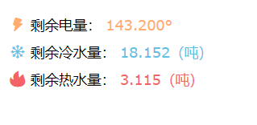

# zhfd-mailnotify

定时自动获取 `施王智慧房东` 小程序上的水电剩余量，并通过邮件通知



## 使用方法

1. 配置

复制一份 `config-example.json` 文件，命名为 `config.json`

按照示例注释进行配置即可

> 注：`Authorization` 字段需要自己手动抓小程序的包获得

2. 运行

在服务器中，安装好 docker 和 docker-compose 环境，这里省略安装步骤

在项目根目录中，运行命令启动程序：

```shell
docker-compose up -d --build

# or
docker compose up -d --build
```